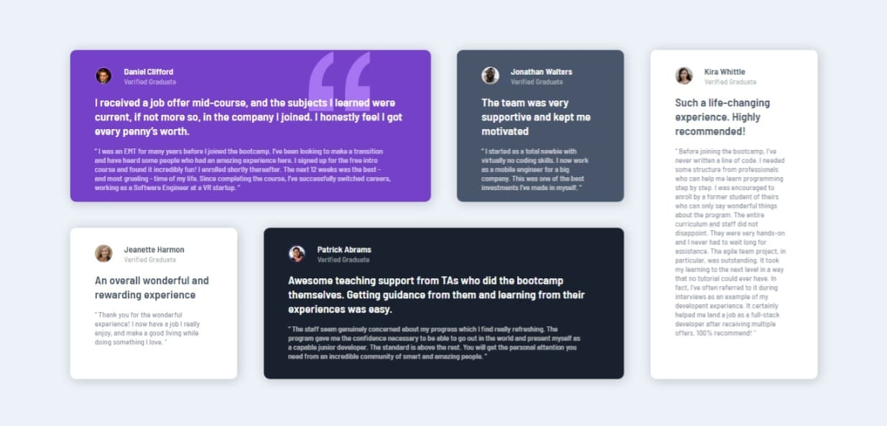

# Frontend Mentor - Testimonials grid section solution

This is a solution to the [Testimonials grid section challenge on Frontend Mentor](https://www.frontendmentor.io/challenges/testimonials-grid-section-Nnw6J7Un7). Frontend Mentor challenges help you improve your coding skills by building realistic projects.

## Table of contents

- [Overview](#overview)
  - [The challenge](#the-challenge)
  - [Screenshot](#screenshot)
  - [Links](#links)
- [My process](#my-process)
  - [Built with](#built-with)
  - [What I learned](#what-i-learned)
  - [Continued development](#continued-development)
  - [Useful resources](#useful-resources)
- [Author](#author)

## Overview

### The challenge

Users should be able to:

- View the optimal layout for the site depending on their device's screen size

### Screenshot



### Links

- Solution URL: [Frontend Mentor](https://www.frontendmentor.io/solutions/responsive-testimonials-grid-section-using-sassscss-and-css-grid-Bk9OgeePc)
- Live Site URL: [GitHub Page](https://ax-cd.github.io/testimonials-grid-section-challenge/)

## My process

### Built with

- Mobile-first workflow
- HTML5
- SCSS/SASS
- CSS Grid

### What I learned

The biggest challenge was to arrange the cards using grid and I'm happy to have overcome it.

```css
main {
  @include desktop {
    display: grid;
    gap: 0.5rem;
    grid-template-columns: repeat(4, 1fr);
    grid-template-rows: 50% 50%;
    margin: 0 10rem;
  }
}
```

### Continued development

In future projects I want to ba able to use Grid with the same ease as I use Flexbox. I also want to continue using Sass but go further with what it can do.

### Useful resources

- [Grid Garden](https://cssgridgarden.com/) - A short and helpful game to be quickly reminded of CSS Grid rules.
- [Sass Documentation](https://sass-lang.com/documentation) - I looked up to the Sass documentation here and there to write code with the right syntax.

## Author

- GitHub - [Ax-cd](https://github.com/Ax-cd)
- Frontend Mentor - [@Ax-cd](https://www.frontendmentor.io/profile/Ax-cd)
- Instagram - [@ax.coding](https://www.instagram.com/ax.coding/)
